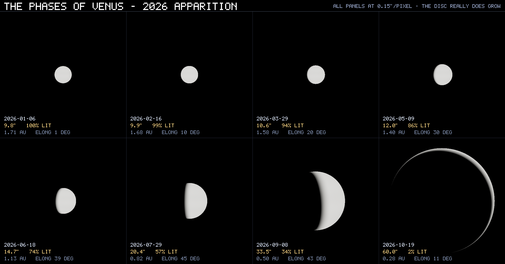

# I missed the occultation, so I built one

**On 14 September 2026 the Moon passed in front of Venus.** It was visible from
Chennai in broad daylight — Venus vanished behind the Moon's dark limb at
12:00:30 UT and came back out 75 minutes later. I missed it.

So I wrote a simulation that puts it back, and then kept going: a film that
explains *why* Venus looks the way it does at all.

## Watch it

**▶ [Watch on YouTube](https://youtu.be/bXCWeaN4b8Y)** — 3:38, 1080p, with chapters.

Or play it right here:

https://github.com/venkatchm/venus-phases-2026/raw/main/media/venus_the_whole_story.mp4

<video src="https://github.com/venkatchm/venus-phases-2026/raw/main/media/venus_the_whole_story.mp4" controls width="100%"></video>

### The vertical cut

Forty-four seconds, 1080×1920, made for a phone held upright — the whole
argument compressed to its shortest honest form.

https://github.com/venkatchm/venus-phases-2026/raw/main/media/venus_reel.mp4

<video src="https://github.com/venkatchm/venus-phases-2026/raw/main/media/venus_reel.mp4" controls width="360"></video>

### Everything else

- [45-second preview](https://github.com/venkatchm/venus-phases-2026/raw/main/media/venus_phases_preview.mp4)
  — the argument quickly, 960×540
- [v1.0 release](https://github.com/venkatchm/venus-phases-2026/releases/tag/v1.0)
  — full-quality masters: the whole film (113 MB), Part One alone (69 MB),
  Part Two alone (44 MB)



*Eight dates from superior to inferior conjunction, every panel at the same
0.15 arcseconds per pixel. Venus is full and tiny at 1.71 AU on the left, and a
huge thin crescent at 0.28 AU on the right. It is not growing — it is coming
closer.*

## What it actually does

Nothing here is drawn by hand, and there are **no image assets in the repository
at all** — no textures, no planet maps, no ephemeris files. Every frame is
computed:

**Positions** come from truncated VSOP87D series for Earth and Venus and a
truncated ELP-2000/82 for the Moon, evaluated at run time. Light-time
correction, annual aberration, nutation, precession, and the topocentric
transformation for an observer standing at a specific latitude on a rotating
Earth are all applied in the order Meeus specifies.

**The phase is never set.** Each body's light direction is derived from its own
position — with the Sun at the origin, `normalize(sun - body)` is just
`-normalize(pos)` — so the lit hemisphere cannot point anywhere except at the
Sun. The crescent is an output of the ray trace, not an input to it.

**The occultation happens for the right reason.** Venus disappears because the
Moon's sphere is nearer to the observer than Venus' sphere and gets in the way.
Depth ordering hides it. There is no "now hide Venus" instruction anywhere.

**Surfaces are physical.** The Moon uses Lommel–Seeliger scattering rather than
Lambert, because lunar regolith backscatters — it looks like a flat coin, not a
shaded ball, which is exactly what the real Moon conspicuously does. Its 14
named maria sit at their true selenographic coordinates with real albedos
(0.074 against 0.150 for the highlands), it is correctly tidally locked, and
craters cast real shadows near the terminator. Venus is deliberately almost
featureless, because in visible light it is.

**The atmosphere is modelled, not tinted.** Bodies are attenuated by extinction
with the full airlight added *in front* of them. That single term is why the
Moon's dark limb is simply absent in daylight and reappears once the sky darkens.

## The September 2026 event

| | |
|---|---|
| Disappearance | 2026-09-14 12:00:30 UT |
| Reappearance | 2026-09-14 13:15:33 UT |
| Duration | 75 minutes |
| Visible from | parts of Asia, Africa and Europe |
| Sun altitude | **+10°** — this happened in daylight |
| Venus | magnitude −4.76, 29 % lit, 36.8″ across |

The simulation solves the contact times itself by scanning for the limb crossing
and bisecting, then renders the event from any of 26 sites. It also computes the
global visibility footprint, which is why it can tell you that New York saw
nothing.

## And why Venus has phases at all

The occultation raises a question it cannot answer from the ground: why does
Venus show phases, why does it never stray far from the Sun, and why is the thin
crescent the *biggest*? That needed a camera that could leave the Earth, so
there is a second renderer for the heliocentric scene.

The three moments the film is built around are **solved, not typed in** — the
code scans the elongation curve, finds the turning points, and names each one
from the geometry:

| Beat | Solved here | Published | Difference |
|---|---|---|---|
| Superior conjunction | 2026-01-06 16:01 UT | Jan 6 | **76 seconds** |
| Greatest eastern elongation | 2026-08-15 06:30 UT, 45.90° | Aug 15 06 UT, 46° | **30 minutes** |
| Inferior conjunction | 2026-10-24 03:49 UT | Oct 24 04 UT | **10 minutes** |

## How I know it is right

`make test` runs **74 checks**, and nothing is compared against this project's
own earlier output. Expected values come from Meeus' worked examples, the IAU
WGCCRE pole tables, and published 2026 phenomena.

Four of them measure **rendered pixels** rather than code, because that is the
only way to know the picture inherited the physics:

- the brightness centroid of a partly lit sphere must sit off its geometric
  centre, **sunward**
- the bright limb must point at the Sun in the telescopic shots, where the Sun
  is off-frame and so nothing in the image could have been fitted to it
- the rendered disc diameter must match `angular_radius_deg` at three different
  panel widths, which is what makes "the crescent is bigger" a measurement
- Venus placed behind the Sun must not punch through it

Writing those tests found three errors that rendered perfectly plausibly while
being wrong: the Earth's rotation axis pointing 46.9° off true, Venus spinning
*prograde* when it famously turns retrograde, and "inferior conjunction" computed
as the minimum of angular separation rather than the ecliptic-longitude crossing
the almanacs use — which is ten hours out, and was caught only by checking
against a published time.

## Run it

```bash
./run.sh                 # builds the venv, launches the interactive simulation
make test                # the 74 checks
make phases              # re-render the Venus phases film
make animation           # re-render the occultation
```

Interactive controls: `1` `2` `3` switch between the sky, the orbital geometry
and the visibility footprint; `T` steps through the key moments; `A` removes the
atmosphere; `N`/`P` change observing site.

See [docs/REPRODUCE.md](docs/REPRODUCE.md) for how every file was made and
[docs/WATCHING.md](docs/WATCHING.md) for a shot-by-shot guide to the film.

## Built with

Python 3.12 and [Taichi](https://www.taichi-lang.org/). Roughly 5,000 lines,
no image assets, no ephemeris data files, four dependencies.

## Sources

- Jean Meeus, *Astronomical Algorithms*, 2nd ed. — the VSOP87 and ELP-2000/82
  truncations, nutation, parallax, and the worked examples used as tests
- IAU WGCCRE (2015) — rotation-pole orientations
- Hilton (2005) / *Astronomical Almanac* — Venus' magnitude law
- Published 2026 Venus phenomena, used to check the solved beats from outside
